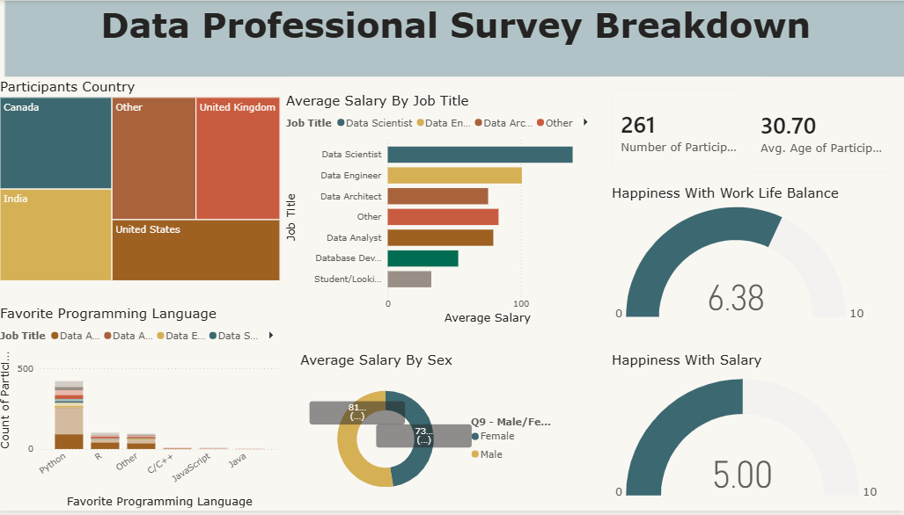

#  Data Professional Survey Breakdown | Power BI Dashboard

An interactive Power BI dashboard analyzing survey responses from **261 data professionals** worldwide — covering demographics, job roles, salaries, programming language preferences, and job satisfaction.

---

##  Dashboard Preview



>  If the image doesn't render above, view it directly here:
> https://github.com/Merajhusen7/Data_Professional_Survey/blob/main/Dashboard_Data_Professional_Survey.png

---

##  Project Overview

This dashboard visualizes the results of a survey conducted among data professionals to uncover trends in:

- **Where** data professionals are located
- **What roles** they hold and **how much** they earn
- **Which programming languages** they prefer
- **How satisfied** they are with their salary and work-life balance
- **Salary differences** across gender

The goal is to turn raw survey data into a clean, single-page, decision-ready dashboard using **Power BI**.

---

##  Key Insights

| Metric | Value |
|---|---|
| 👥 Number of Participants | **261** |
| 🎂 Average Age of Participants | **30.70 years** |
| 😊 Happiness with Work-Life Balance | **6.38 / 10** |
| 💰 Happiness with Salary | **5.00 / 10** |

- **Top Participant Countries:** United States, Canada, India, United Kingdom, and Others
- **Highest Paying Role:** Data Scientist, followed by Data Engineer and Data Architect
- **Most Popular Programming Language:** Python, by a significant margin over R, C/C++, JavaScript, and Java
- **Salary by Gender:** Male and Female average salaries were compared via a donut chart breakdown

---

## 📁 Repository Contents

```
Data_Professional_Survey/
│
├── Dashboard_Data_Professional_Survey.png   # Dashboard screenshot / preview image
├── Data_Professional_Survey.pbit             # Power BI Template file (dashboard source)
└── README.md                                  # Project documentation
```

---

## 🛠️ Tools & Technologies Used

- **Power BI Desktop** — dashboard design & visualization
- **Power Query** — data cleaning & transformation
- **DAX (Data Analysis Expressions)** — calculated measures (e.g., average salary, happiness scores)

---

## 📊 Dashboard Features

- 🗺️ **Participants Country** breakdown (tree map)
- 📈 **Average Salary by Job Title** (horizontal bar chart, filterable by Job Title)
- 💻 **Favorite Programming Language** by Job Title (stacked column chart)
- ⚖️ **Average Salary by Sex** (donut chart)
- 🎯 **KPI Cards** for total participants and average age
- ⏱️ **Gauge Charts** for happiness with work-life balance and salary
- 🔎 Interactive **slicers/filters** for cross-filtering all visuals by Job Title

---

## 🚀 How to Use This Dashboard

1. **Clone or download** this repository:
   ```bash
   git clone https://github.com/Merajhusen7/Data_Professional_Survey.git
   ```
2. Open **`Data_Professional_Survey.pbit`** using [Power BI Desktop](https://powerbi.microsoft.com/desktop/) (free download).
3. Since this is a `.pbit` **template file**, Power BI will prompt you to either:
   - Load the original data source, **or**
   - Enter parameter values (if any were set) before the report loads.
4. Explore the dashboard — click on any bar, slice, or category to cross-filter the entire report.

---

## 📷 Preview

<p align="center">
  
</p>

---

## 🙋‍♂️ Author

**Meraj Husen**
🔗 GitHub: [@Merajhusen7](https://github.com/Merajhusen7)

If you found this project useful or interesting, consider giving the repo a ⭐!

---

## 📄 License

This project is open-source and available for learning and portfolio purposes. Feel free to fork and build on it.
